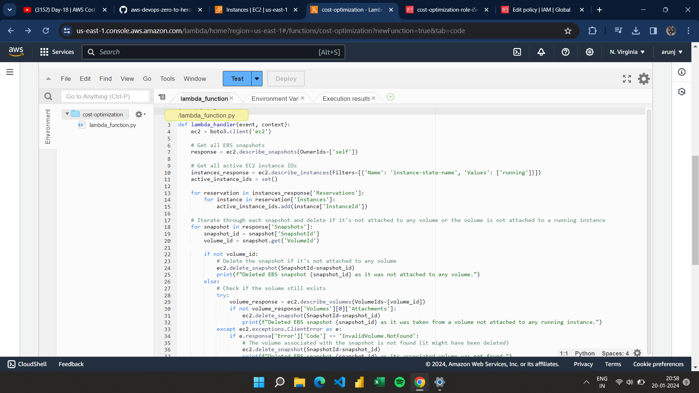
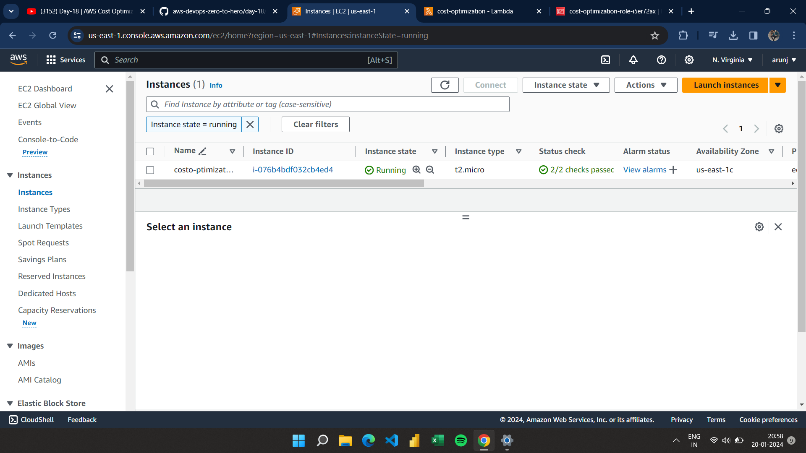
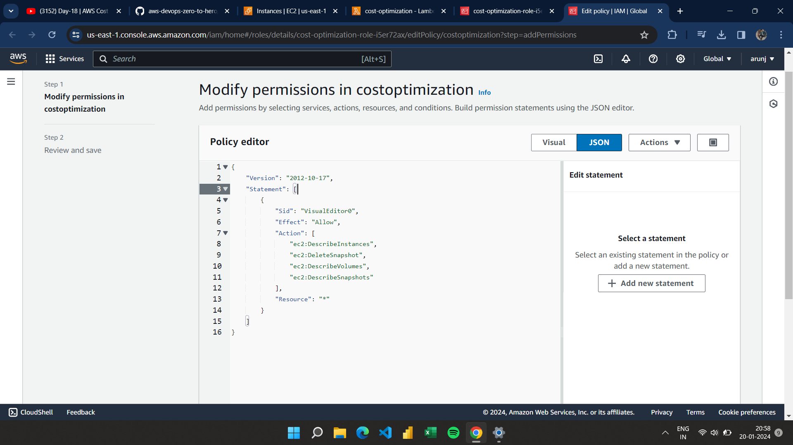
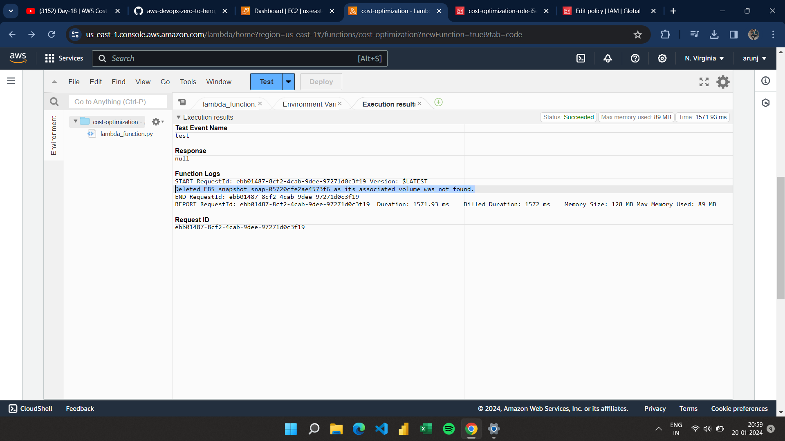

# AWS Cloud Cost Optimization - Stale EBS Snapshot Cleanup

## Overview

This project focuses on optimizing AWS cloud storage costs by identifying and removing stale Elastic Block Store (EBS) snapshots. A Lambda function is employed to automatically detect EBS snapshots that are no longer associated with any active EC2 instances and subsequently delete them.

## Description

The Lambda function performs the following steps:

The Lambda function fetches all EBS snapshots owned by the same account and also retrieves a list of active EC2 instances (running and stopped). For each snapshot, it checks if the associated volume (if exists) is not associated with any active instance. If it finds a stale snapshot, it deletes it, effectively optimizing storage costs.

1. **Fetch Snapshots:**
   - Retrieves all EBS snapshots owned by the AWS account .

2. **Get Active EC2 Instances:**
   - Fetches a list of active EC2 instances, including those in a running or stopped state.

3. **Identify Stale Snapshots:**
   - For each EBS snapshot, it checks if the associated volume (if it exists) is not linked to any active EC2 instance.

4. **Delete Stale Snapshots:**
   - If a stale snapshot is identified, the Lambda function deletes it, contributing to effective storage cost optimization.

## Usage

Follow these steps to utilize the Lambda function for EBS snapshot cleanup:

1. **Deployment:**
   - Deploy the Lambda function using the AWS Management Console or AWS CLI.

2. **IAM Role Configuration:**
   - Configure the Lambda function's IAM role with the necessary permissions to describe EC2 instances, describe EBS snapshots, and delete EBS snapshots.

3. **Scheduling:**
   - Set up a schedule for the Lambda function execution using AWS CloudWatch Events for periodic snapshot cleanup.

## Prerequisites

Ensure the following prerequisites are met before using this project:

- AWS account with the required permissions.
- Python 3.x for local testing (optional).

## Installation

No additional installation steps are needed. Simply deploy the Lambda function and configure the IAM role as described in the "Usage" section.

## Contributing

Contributions to enhance and improve this cost optimization project are welcome! Feel free to submit issues or pull requests.

## Acknowledgments

- AWS SDK for Python (Boto3)
- Inspired by the need for EBS snapshot cost optimization.

1. **Lambda Function Execution Flow:**
   

2. **AWS Console Screenshot:**
   

3. **AWS Modifying Permissions  Screenshot:**
      

4. **AWS lambda_execution_result Screenshot:**
   
